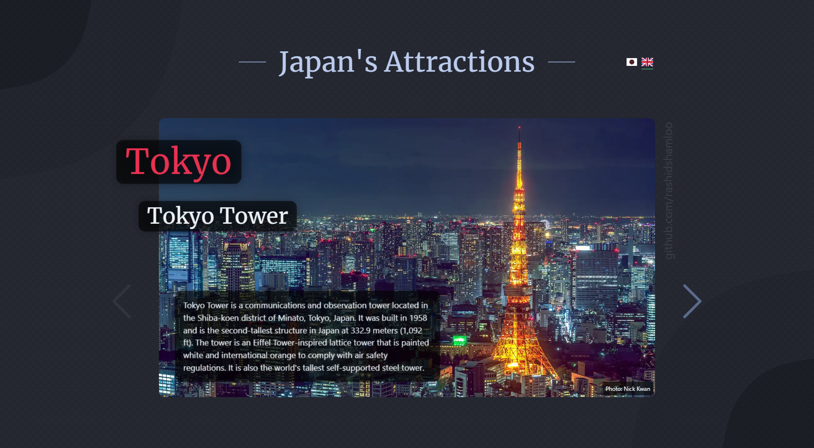
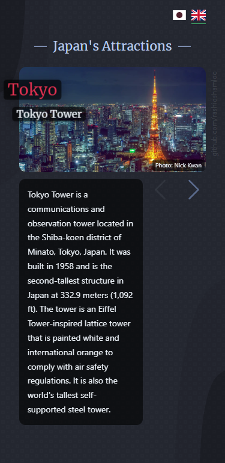

# Japan Slider
A slider showcasing Japan's various attractions

## Table of contents

- [Overview](#overview)
  - [Links](#links)
  - [Video](#video)
  - [Screenshot](#screenshot)
- [Built with](#built-with)
- [My process](#my-process)
- [Author](#author)

## Overview

### Links

- Live Site: https://rashidshamloo.github.io/japan-slider/

### Video

https://github.com/rashidshamloo/japan-slider/assets/121501991/37a26782-9138-4802-a5c6-fd72f172241f

### Screenshot

- Desktop

- Mobile

## Built with

- [TypeScript](https://www.typescriptlang.org/)
- [React](https://react.dev/)
- [Vite.js](https://vitejs.dev/)
- [Tailwind CSS](https://tailwindcss.com/)
- [Swiper](https://swiperjs.com/)
- [React Next Tilt](https://www.npmjs.com/package/react-next-tilt)

## My process

I started this project to learn more about sliders. I also wanted to integrate my own tilt component ([react-next-tilt](https://www.npmjs.com/package/react-next-tilt)) into the slides. in doing so I ran into the problem of Swiper's Parallax module not supporting animations along the z-axis. I modified the module and added z-axis support and published it as a package so others can use it as well in case they run into a similar problem:

- `swiper-mods` package: https://www.npmjs.com/package/swiper-mods

For the content, I googled Japan's tourist attractions and selected the ones I found interesting, then used Bing Chat to generate the info in English and Google Translate to translate it into Japanese.

For the images, they are from [Pexels](https://www.pexels.com/), [Unsplash](https://unsplash.com/), or [Flickr](https://www.flickr.com/). I cropped them in Photoshop, converted them to `webp` using [ffmpeg](https://ffmpeg.org/), and edited the metadata using [ExifTool](https://exiftool.org/).

## Author

Rashid Shamloo

- Portfolio - [rashidshamloo.ir](https://www.rashidshamloo.ir)
- Linkedin - [rashid-shamloo](https://www.linkedin.com/in/rashid-shamloo/)
- Frontend Mentor - [@rashidshamloo](https://www.frontendmentor.io/profile/rashidshamloo)
- Twitter - [@rashidshamloo](https://www.twitter.com/rashidshamloo)
- Dev.to - [@rashidshamloo](https://dev.to/rashidshamloo)
